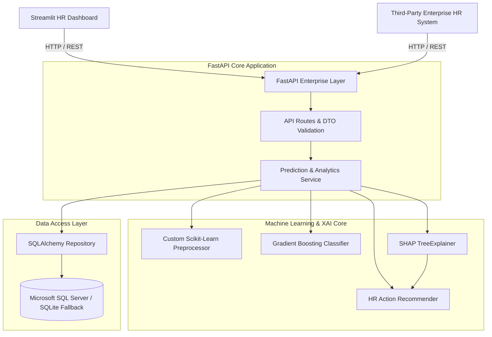

# Enterprise Employee Attrition Prediction System

A production-grade, clean-architecture artificial intelligence platform designed for Enterprise Human Resources (HR) departments to forecast employee attrition, explain AI decisions using SHAP (SHapley Additive exPlanations), and automatically generate targeted, actionable HR retention recommendations.

---

## 🏗️ Architectural Overview



---

## ✨ Key System Features

- **Predictive ML Pipeline**: Trained Gradient Boosting Classifier predicting attrition probability and classifying risk levels (`Low`, `Medium`, `High`).
- **Explainable AI (SHAP)**: Identifies exact local feature contributions pushing employee attrition risk higher or lower.
- **Actionable HR Recommender Engine**: Maps top SHAP risk drivers to targeted HR interventions (e.g. Overtime Caps, Hybrid Work, Salary Benchmark Review, Career Roadmaps).
- **SQL Server Database Integration**: Enterprise SQL schemas (`Users`, `Employees`, `Predictions`, `PredictionHistory`) with automatic local SQLite fallback for seamless development.
- **REST API Suite**: Fast, validated REST API endpoints (`/predict`, `/batch-predict`, `/dashboard`, `/history`, `/employees`) built with FastAPI and OpenAPI Swagger documentation.
- **Interactive Executive Dashboard**: Modern Streamlit HR UI featuring glassmorphism cards, Plotly charts, single employee risk scoring, CSV/Excel batch upload, and audit logging.

---

## 🛠️ Technology Stack

- **Backend Framework**: Python 3.10+, FastAPI, Uvicorn, Pydantic v2
- **Machine Learning & XAI**: Scikit-Learn, SHAP, Pandas, NumPy, Joblib
- **Database & ORM**: Microsoft SQL Server (T-SQL), PyODBC, SQLAlchemy 2.0
- **Frontend Dashboard**: Streamlit, Plotly Express
- **Environment & Config**: Pydantic Settings, Python-Dotenv, Logging

---

## 📁 Folder Structure

```
c:\Work\Python Projects\Attrition Prediction System\
├── .env                    # Active environment settings
├── .env.example            # Environment configuration template
├── requirements.txt        # Python dependency manifest
├── schema.sql              # Microsoft SQL Server T-SQL script
├── README.md               # Project documentation
├── INSTALLATION.md         # Setup and run guide
├── data/
│   ├── hr_attrition.csv    # Synthetic IBM HR benchmark dataset
│   └── test_samples/       # Sample JSON, CSV, and Excel test payloads
├── artifacts/
│   ├── model.joblib        # Trained classifier binary
│   ├── preprocessor.joblib # Fitted preprocessor binary
│   └── metrics.json        # Evaluation performance report
├── src/
│   ├── config/             # Pydantic Settings configuration
│   ├── domain/             # Entities and custom exceptions
│   ├── database/           # ORM models, connection factory, seeder, repository
│   ├── ml/                 # Generator, preprocessor, trainer, SHAP explainer, recommender
│   ├── services/           # Business logic orchestrators
│   ├── api/                # FastAPI application, DTO schemas, and routers
│   └── utils/              # Structured logger
├── dashboard/
│   ├── app.py              # Streamlit multi-page dashboard
│   └── components/         # KPI cards and Plotly chart builders
└── tests/
    └── test_pipeline.py    # Automated integration test suite
```

---

## 🚀 Quick Start Guide

### 1. Install Dependencies
```bash
pip install -r requirements.txt
```

### 2. Seed Database & Train Machine Learning Model
Run the seeder and training scripts to populate initial employee data, generate test samples, and train the model:
```bash
python -m src.database.seed_data
python -m src.ml.trainer
```

### 3. Launch FastAPI Enterprise Server
Start the backend REST API server:
```bash
python -m src.api.app
```
Interactive API documentation will be available at: **[http://127.0.0.1:8000/docs](http://127.0.0.1:8000/docs)**

### 4. Launch Streamlit HR Dashboard
In a new terminal window, start the executive dashboard UI:
```bash
streamlit run dashboard/app.py
```
The dashboard will open automatically in your browser at: **[http://localhost:8501](http://localhost:8501)**

---

## 🧪 Running Automated Tests

To execute the integration test suite covering database operations, model inference, SHAP explanations, and REST API endpoints:
```bash
python -m unittest tests/test_pipeline.py
```

---

## 📄 License
Enterprise Portfolio Project - Developed following Clean Architecture and Production Software Engineering Principles.
